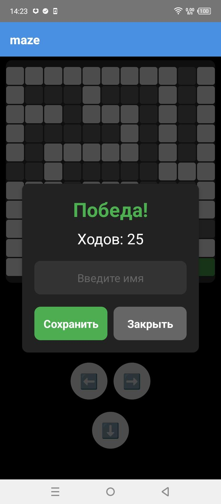

# Maze Game / Игра Maze

[English](#english) | [Русский](#russian)

<a name="english"></a>
## English

Maze is a maze game developed with React Native.

### Description

Maze is a game where the player must navigate through a maze from start to finish while avoiding obstacles. The game features:
- Various maze patterns
- Move counter system
- Leaderboard
- Score saving

### Screenshots

<table>
  <tr>
    <td align="center">
      <br />
      <em>Gameplay</em>
    </td>
    <td align="center">
      <br />
      <em>Win Screen</em>
    </td>
    <td align="center">
      <br />
      <em>Leaderboard</em>
    </td>
  </tr>
</table>

### Installation

1. Make sure you have [Node.js](https://nodejs.org/) installed.
2. Clone the repository:
   ```bash
   git clone https://github.com/polexka/maze-game.git
   ```
3. Install dependencies:
   ```bash
   npm install
   ```
   
4. **Build and Install**:
   - For iOS: You can install the app using the `.app` file located in the `release` folder.
   - For Android: You can install the app using the `.apk` file also located in the `release` folder.
5. Run the project:
   ```bash
   npx react-native start
   ```

### How to Play

1. Use control buttons to move the character
2. Reach the goal in minimum moves
3. Enter your name after completing the level to save your score
4. View the leaderboard

### Technologies

- React Native
- Expo
- AsyncStorage for data persistence
- React Navigation

### Project Structure

```
src/
  ├── components/ # React components
  │ ├── GameCell.tsx # Game cell component
  │ ├── GameControls.tsx # Control elements
  │ ├── GameGrid.tsx # Game board
  │ ├── WinScreen.tsx # Win screen
  │ └── GameScreen.tsx # Main game screen
  │ └── LeaderboardScreen.tsx # Leaderboard screen
  └── utils/ # Utilities
  ├── gameUtils.ts # Game logic
  ├── obstaclePatterns.ts # Obstacle patterns
  └── storageUtils.ts # Storage operations
```

### License

MIT

---

<a name="russian"></a>
## Русский

Maze - это игра-лабиринт, разработанная на React Native с использованием Expo.

### Описание

Maze - это игра, в которой игрок должен пройти через лабиринт от старта до финиша, избегая препятствий. Игра включает в себя:
- Различные паттерны лабиринтов
- Систему подсчета ходов
- Таблицу рекордов
- Сохранение результатов

### Скриншоты

<table>
  <tr>
    <td align="center">
      <br />
      <em>Игровой процесс</em>
    </td>
    <td align="center">
      <br />
      <em>Экран победы</em>
    </td>
    <td align="center">
      <br />
      <em>Таблица рекордов</em>
    </td>
  </tr>
</table>

### Установка

1. Убедитесь, что у вас установлен [Node.js](https://nodejs.org/)
2. Клонируйте репозиторий:
   ```bash
   git clone https://github.com/polexka/maze-game.git
   ```
3. Установите зависимости:
   ```bash
   npm install
   ```
4. **Сборка и установка**:
   - Для iOS: вы можете установить приложение, используя файл `.app`, который находится в папке `release`.
   - Для Android: вы можете установить приложение, используя файл `.apk`, который также находится в папке `release`.
5. Запустите проект:
   ```bash
   npx react-native start
   ```

### Как играть

1. Используйте кнопки управления для перемещения персонажа
2. Доберитесь до цели за минимальное количество ходов
3. После прохождения уровня введите свое имя для сохранения результата
4. Просматривайте таблицу рекордов

### Технологии

- React Native

### Структура проекта

```
src/
  ├── components/         # React компоненты
  │   ├── GameCell.tsx    # Ячейка игрового поля
  │   ├── GameControls.tsx # Элементы управления
  │   ├── GameGrid.tsx    # Игровое поле
  │   └── WinScreen.tsx   # Экран победы
  │   └── GameScreen.tsx  # Основной игровой экран
  │   └── LeaderboardScreen.tsx  # Основной игровой экран
  └── utils/             # Утилиты
      ├── gameUtils.ts   # Игровая логика
      ├── obstaclePatterns.ts # Паттерны препятствий
      └── storageUtils.ts # Работа с хранилищем
```

### Лицензия

MIT 